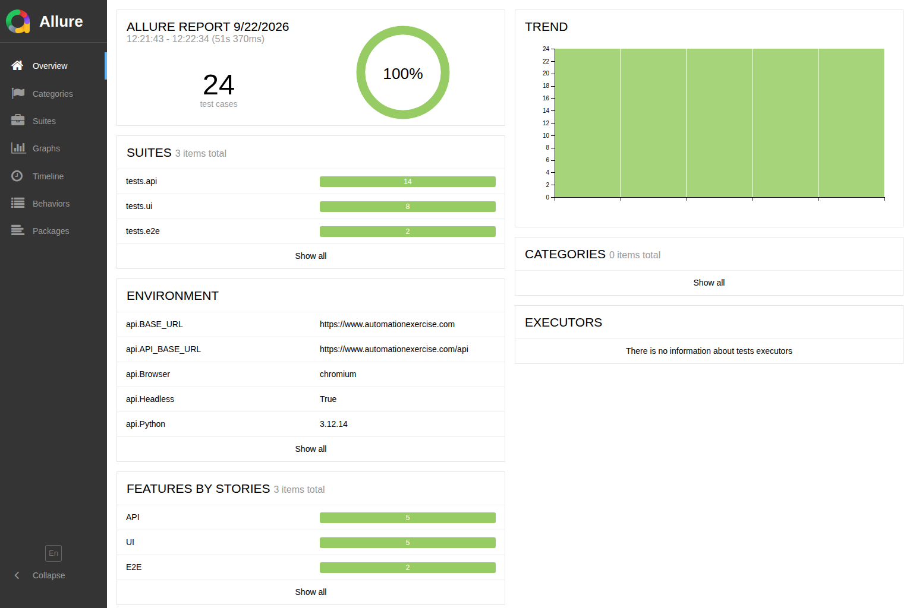

# E-commerce Test Automation Framework

[](https://github.com/WolfGung/Marketplace-Test-Automation-Framework/actions/workflows/ci.yml)
[](https://wolfgung.github.io/Marketplace-Test-Automation-Framework/report/)

Start with the evidence: **[the live Allure report](https://wolfgung.github.io/Marketplace-Test-Automation-Framework/report/)** holds every case, its steps and the trend across runs, and **[the project page](https://wolfgung.github.io/Marketplace-Test-Automation-Framework/)** — generated from the run that produced the numbers on it — carries a recording of the purchase running front to back and **[the Playwright trace of that same purchase](https://trace.playwright.dev/?trace=https://wolfgung.github.io/Marketplace-Test-Automation-Framework/media/checkout-trace.zip)**, which can be stepped through action by action with the page's DOM at each step.

[](https://wolfgung.github.io/Marketplace-Test-Automation-Framework/report/)

A production-style test automation framework for an e-commerce / marketplace application, built with **Python, Pytest and Playwright**.

The project demonstrates a scalable approach to automated testing across multiple layers — **UI, REST API and end-to-end flows** — with reusable test infrastructure, structured test data, reporting and CI/CD integration.

[![Three bands. At the top the three test directories. Below them the code every test reuses: the HTTP client and the API resources, the page objects, the typed models, the per-run data factory and the settings. At the bottom the application under test, drawn as somebody else's system: the marketplace and its REST API. The API tests reach the API through the client, the browser tests reach the site through Playwright driving Chromium, and the end-to-end path runs down the middle through both doors at once. The figure states a case count for each directory; open it to read them.](showcase/assets/architecture.svg)](showcase/assets/architecture.svg)

Tests hold the assertions; everything reusable sits below them, so a change in the application lands in one file. The end-to-end path is the one route that crosses both doors. [Open the diagram at full size.](showcase/assets/architecture.svg)

## Application Under Test

Tests run against the public demo marketplace **[Automation Exercise](https://www.automationexercise.com/)**.

It is a good fit for this portfolio project because it exposes:

- a full storefront (auth, catalog, search, cart, checkout)
- a documented [REST API](https://www.automationexercise.com/api_list) for products, brands, search and accounts
- realistic API/UI cross-validation scenarios

This is a third-party public site. Tests create disposable accounts and delete them after use. Occasional flakiness from ads, rate limits or downtime is expected. The pipeline acts on that: every run first probes the storefront, and the browser suite runs only when the probe answers HTTP 200 — otherwise the run states which status it got and that the browser layer was skipped for it, rather than reporting a red suite the application did not cause. The API suite is never gated, because there a failure is the result and not an excuse.

## Tech Stack

- **Python 3.11+**
- **Pytest**
- **Playwright**
- **REST API** (`httpx`)
- **Allure Report**
- **Docker**
- **CI/CD** (GitHub Actions)

## Coverage

Counted by `pytest --collect-only`, and pinned by `tests/unit/test_showcase_figures.py` so a number here cannot drift away from the suite it describes:

| What is checked | Checks | Where |
| --- | --- | --- |
| The REST API | 14 | `tests/api` |
| The browser | 8 | `tests/ui` |
| End to end, across both doors | 2 | `tests/e2e` |
| The application under test | 24 | the three rows above |
| Of those, the smoke set | 5 | `-m smoke` |

Those are the checks of the marketplace, and they are the only ones counted — here, on the published page, and in the figures. The project also carries checks over its own tooling in [`tests/unit/`](tests/unit): its settings, the diagnostics captured when a browser test fails, the report's failure grouping, the build of the published page, and the pins that keep every number above honest. They are deliberately left out of the arithmetic, because they prove nothing about the application under test.

A check sits at the lowest layer that can still prove the thing that matters. Product listings, search results, account creation and deletion and the answers each gives to input it should reject are data rules, so they are asserted against the REST API, where a failure names its own cause. Only behaviour a person can see is driven through a browser. The end-to-end pair exists because the purchase is the one flow whose whole value is that the separate parts hold together.

## Four decisions that keep it maintainable

**API responses are parsed into typed models, not read as dictionaries.** The catalogue and the search results go through `ProductsResponse` and `Product` in [`src/ecom_taf/models/`](src/ecom_taf/models) before a test asserts anything about them, and a registration travels the same way in the other direction through `UserAccount`. A field that is renamed, dropped or returned with the wrong type fails there, naming the field, instead of surfacing three assertions later as a `KeyError` — or as a comparison against `None` that happens to pass.

**One fact is checked through two doors.** [`tests/e2e/test_api_ui_product_consistency.py`](tests/e2e/test_api_ui_product_consistency.py) reads a product from the REST API, opens the same product in the browser and compares the name and the price. Both layers can be green while the two disagree; that disagreement is what a customer sees, and neither suite on its own can catch it.

**The suite is a polite guest on a site it does not own.** The `registered_user` fixture in [`tests/conftest.py`](tests/conftest.py) creates a disposable account through the API, hands it to the test and deletes it afterwards, so a run leaves the application as it found it. That is also why the hook that captures a failure screenshot is written never to raise: a crashed session skips teardown, and skipped teardown means an account left behind on somebody else's site.

**Per-run data comes from a factory, not from constants.** [`src/ecom_taf/data/user_factory.py`](src/ecom_taf/data/user_factory.py) builds a fresh account for every test that needs one, address and all. A suite pinned to a constant email passes once and then fails on "already registered", and the usual repair — deleting the record by hand between runs — is a step that cannot exist inside a pipeline.

## Architecture

```
src/ecom_taf/          # reusable framework (not tests)
  api/                 # HTTP client + resource APIs
  config/              # environment-based settings
  data/                # factories / test data builders
  models/              # typed payloads
  ui/pages/            # Page Object Model
tests/
  api/                 # contract / resource tests
  ui/                  # browser tests
  e2e/                 # business flows + API/UI checks
  unit/                # checks of this framework, not of the marketplace
```

That split is the four decisions above in directory form: a test module holds assertions and nothing else, everything a test reuses sits under `src/ecom_taf/` where a change in the application lands once, and `tests/unit/` checks that framework rather than the marketplace.

Business status codes for this AUT often live in JSON `responseCode` even when HTTP status is 200. The API client normalizes that so tests assert on the real result, not only the transport layer.

## Example E-commerce Scenarios

The test suite includes realistic marketplace workflows such as:

- User registration and authentication
- Product search and filtering
- Product details
- Shopping cart management
- Checkout
- Order creation
- API validation
- UI/API cross-validation
- Negative and boundary scenarios

## Setup

```bash
python3 -m venv .venv
source .venv/bin/activate
pip install -e ".[dev]"
playwright install chromium
cp .env.example .env
```

## Run tests

```bash
# all tests
pytest

# layers
pytest -m api
pytest -m ui
pytest -m e2e
pytest -m smoke

# Allure results
pytest --alluredir=allure-results

# record the end-to-end run: a WebM video and a Playwright trace, one of each
# per e2e case, under videos/ and traces/
RECORD_VIDEO=true pytest -m e2e
playwright show-trace traces/checkout-test_logged_in_user_can_place_an_order.zip

# Allure CLI is not installed via pip. You need Java + Allure 2, then:
allure serve allure-results
```

Useful Make targets: `make install`, `make test-api`, `make test-ui`, `make test-e2e`, `make test`, `make report`.

## Docker

```bash
docker compose run --rm tests
```

By default the container runs API + smoke tests. Override the command to run a specific layer:

```bash
docker compose run --rm tests pytest -m api
```

## Configuration

| Variable | Default | Description |
| --- | --- | --- |
| `TEST_ENV` | `prod` | Named environment from `environments.yaml` |
| `BASE_URL` | `https://www.automationexercise.com` | Storefront |
| `API_BASE_URL` | `https://www.automationexercise.com/api` | REST API |
| `HEADLESS` | `true` | Playwright headless mode |
| `BROWSER` | `chromium` | `chromium`, `firefox` or `webkit` |

## Markers

`api`, `ui`, `e2e`, `smoke`, `negative`, `integration`
